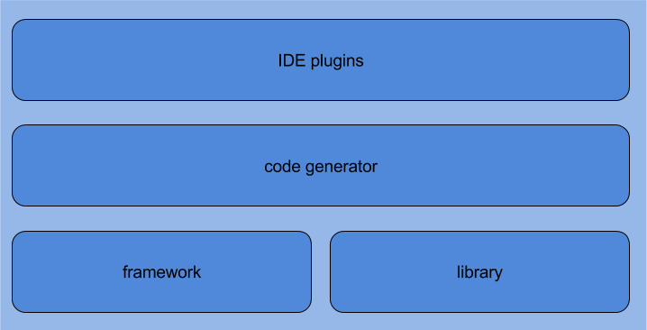

[](https://travis-ci.org/lesaint/damapping)

DAMapping Framework
====================

The DAMapping framework is a component of the [DAMapping bean mapping stack for Java](http://damapping.javatronic.fr).



The DAMapping framework helps the developer structure bean mapping code as classes dedicated to implement bean mapping
and save her or him from writing all that interface+class good practice for testability and easy keeping separation of
concern.

To do that, the DAMapping framework is implemented as an annotation processor that generates the interface and the class
that you would have otherwise written and provides somes other glue such as integration with Dependency Injection
frameworks.

## Installation

### For Maven-based build tools

To be used, the DAMapping annotation-processor has to be a default/compile dependency of your project.

```xml
<dependency>
    <groupId>fr.phan.damapping</groupId>
    <artifactId>damapping-annotation-processor</artifactId>
    <version>0.4.0</version>
    <!-- scope does not need to be explicitly specified, default scope works just fine -->
    <scope>compile</scope>
</dependency>
```

### other tools

An extensive list of dependency declarations is available on this [page](http://search.maven.org/#artifactdetails|fr.javatronic.damapping|damapping-annotation-processor|0.4.0|jar).

## Getting started ...

Check out the [getting started with the DAMapping framework](http://damapping.javatronic.fr/framework/getting-started.html)
page.

## Contact and support

Feel free to create an [issue](https://github.com/lesaint/damapping/issues) even to ask questions and/or contact me on [Twitter](https://twitter.com/LesaintSeb).
